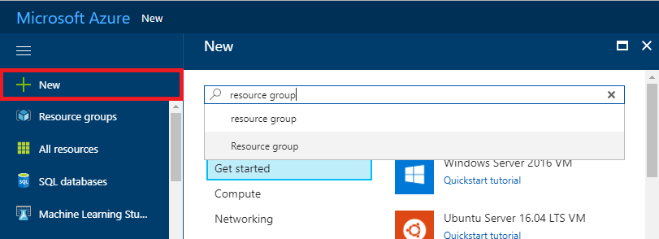

# 01. Create Resource Group

Create a logical group to manage Azure resources.

## Architecture

## Create resource group from Azure Portal

> [NOTE]: If you already have a resource group for the lab, you can skip this step. But, note that you must have *owner* permission of the resource group for hands on lab.

1. Click '+ new' and search 'Resource group'.

    

1. Click 'Create' button.

    

1. Type resource group name and location.

    |Name|Subscription|Location|
    |---|---|---|
    |workshop-###|*yoursubscription*|*West US*|

    

    * Change ### to random 3 digit numbers. For example, name your resource group as 'workshop-777'.
    * Subscription name can be different yours and above sample.
    * Choose locatoin close to your location.

> [NOTE]: Please check 'Pin to Dashboard' so you can access the resource easy.

---

[>> NEXT #02](https://github.com/xlegend1024/az-secu-wrkshp/tree/master/02.CreateVNet/Readme.md)
