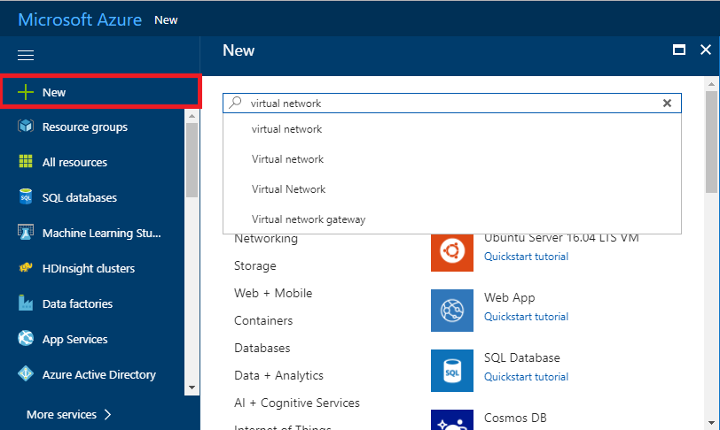
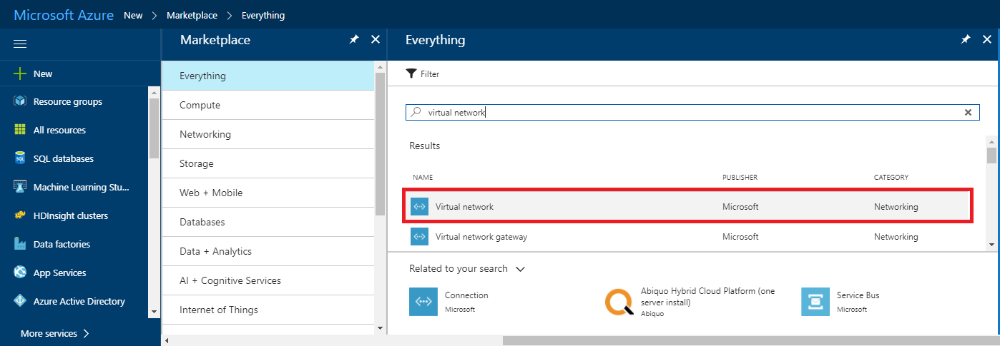
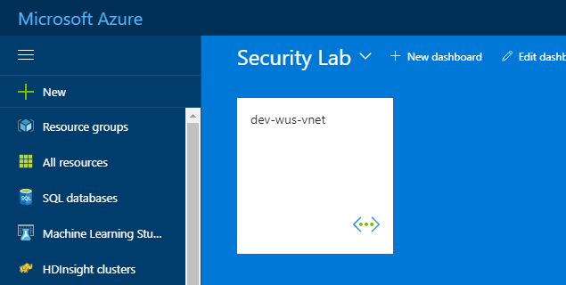

# 2. Create Virtual Network

Create Virtual Network in the resource group.

## Architecture

## Create Virtual Network from Azure Portal

1. Click '+ New' and search 'Virtual Network'

    

1. Click 'Virtual Network'.

    

1. Click 'Create' button.

    > Leave deployment model as __Resource Manager__.

    

1. Type Virtual Network name, change Address space and range and select your resource group.

    |Name|Address Space|Subscription|Resource Group|Location|Subnet Name|Subnet range|
    |---|---|---|---|---|---|---|
    |dev-wus-vnet|10.0.0.0/16|*yoursubscription*|*workshop-###*|West US|default|10.0.1.0/24|

    

1. Click 'Create'.

    Virtual Netowkr will be created.

    

---

[>> NEXT](https://github.com/xlegend1024/az-secu-wrkshp/tree/master/3.CreateNSG/Readme.md)
