# 03. Create Network Security Group

Create a Network Security Group and assign the NSG to the subnet in your Virtual Network.

## NSG Concept

You can control network traffic. Following figure shows how network traffic flows. For example, if a traffic flow into a Virtual Machie, the traffic will go thru Subnet level NSG and then NIC level NSG. And an out bound traffic will go thru NIC level NSG and then subnet level NSG.

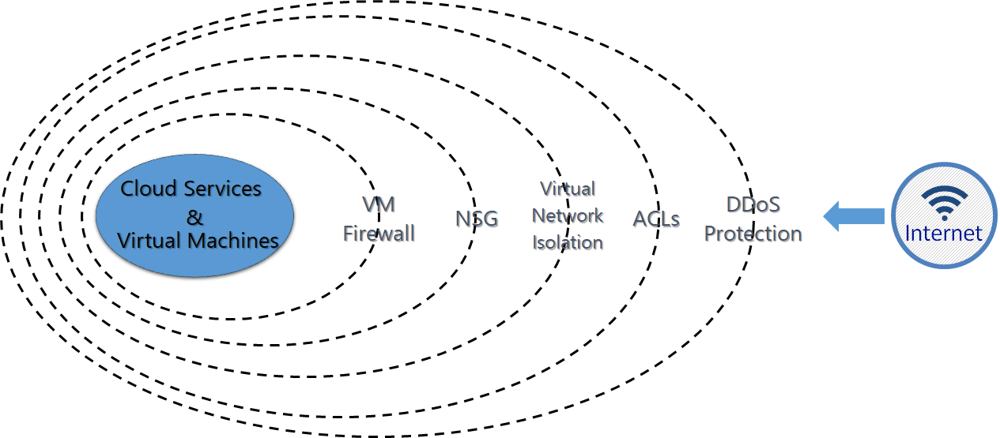

## Architecture

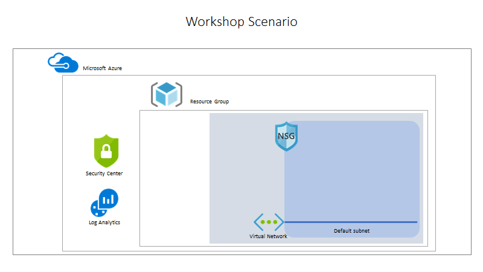

## Create Network Security Group

1. Click '+ New' and search Network Security Group.

    Click 'Create' button.

    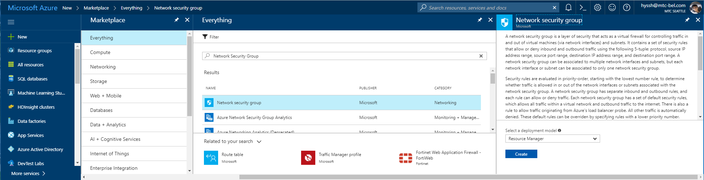

1. Name to your new Network Security Group and create.

    Type name and select your resource group. And please check 'Pin to dashboard'.

    |Name|Subscription|Resource Group|Location|
    |---|---|---|---|
    |dev-wus-nsg|*yoursubscription*|workshop-###|*West US*|

    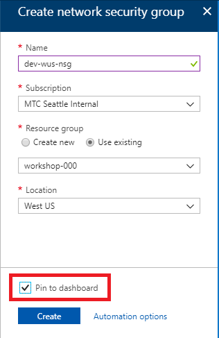

## Add Inbound Security Rules

1. Click Netowkr Security Group.

    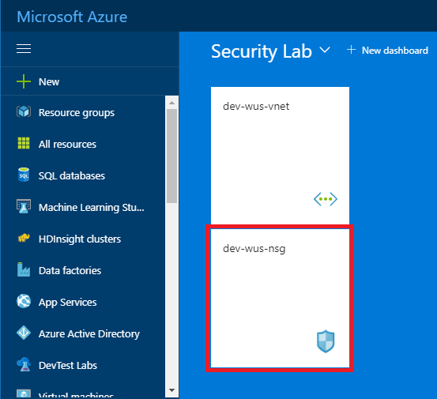

1. Click 'Inbound Security rules' to add new rule.

    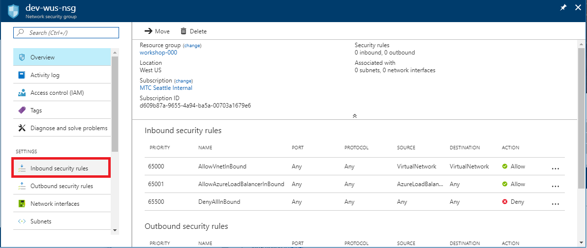

1. Click 'Add'.

    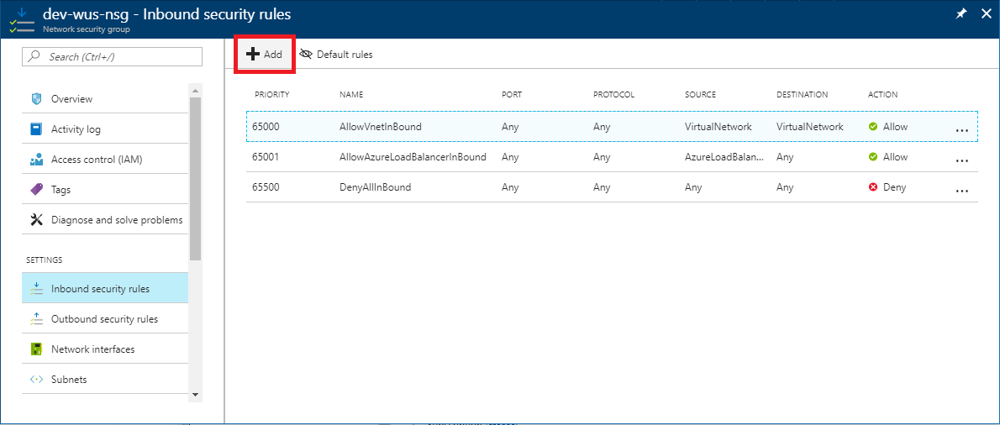

1. Click 'Basic'.

    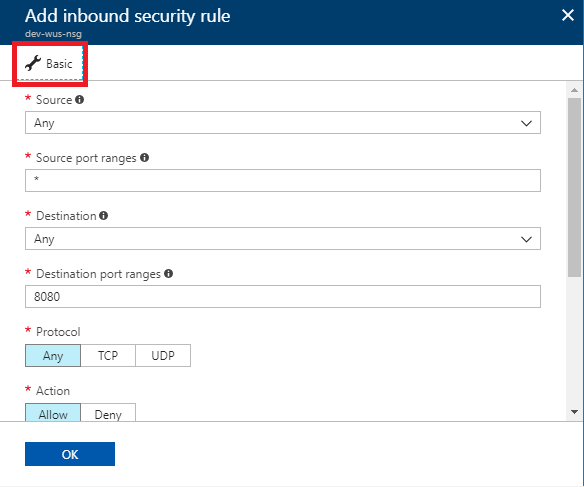

1. Select 'RDP' from the Service list.

    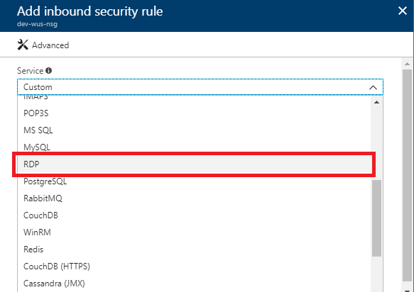

1. Click 'OK'.

    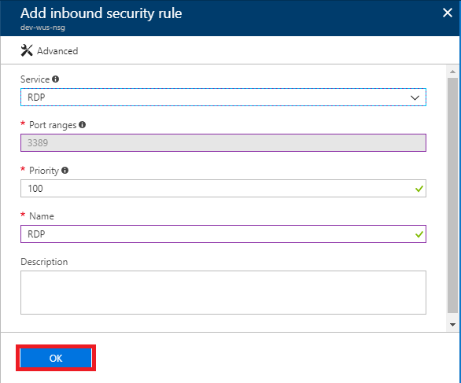

1. One update is done, you'll see port 3389 TCP is added as RDP on the inbound security rule.

    

## Apply the rules to subnet

1. Open your Network Security Group.

    

1. Click 'Subnets' and then click '+ Associate'.

    

1. Click '1.Virtual Network' and then choose your virtual network.

    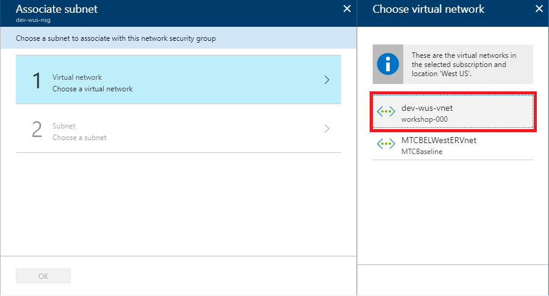

1. Choose 'Default' subnet.

    

1. Confirm your selected options and click 'OK' to continue.

    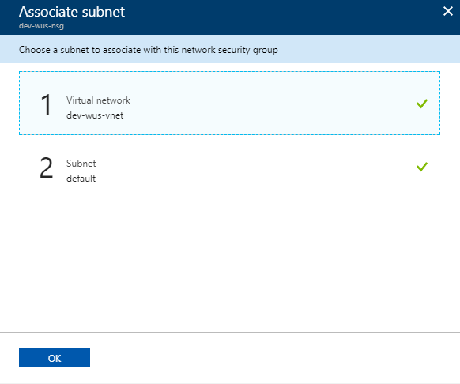

1. Once update is done, you'll see the subnet on the associated list.

    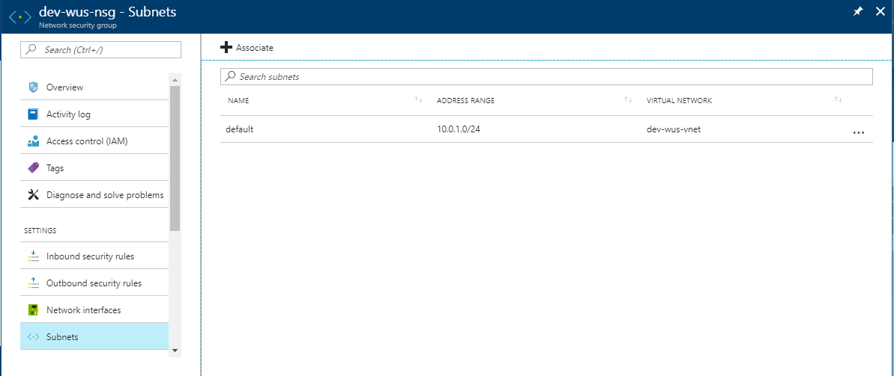
---

[>> NEXT #04](https://github.com/xlegend1024/az-secu-wrkshp/tree/master/04.CreateKeyVault/Readme.md)
