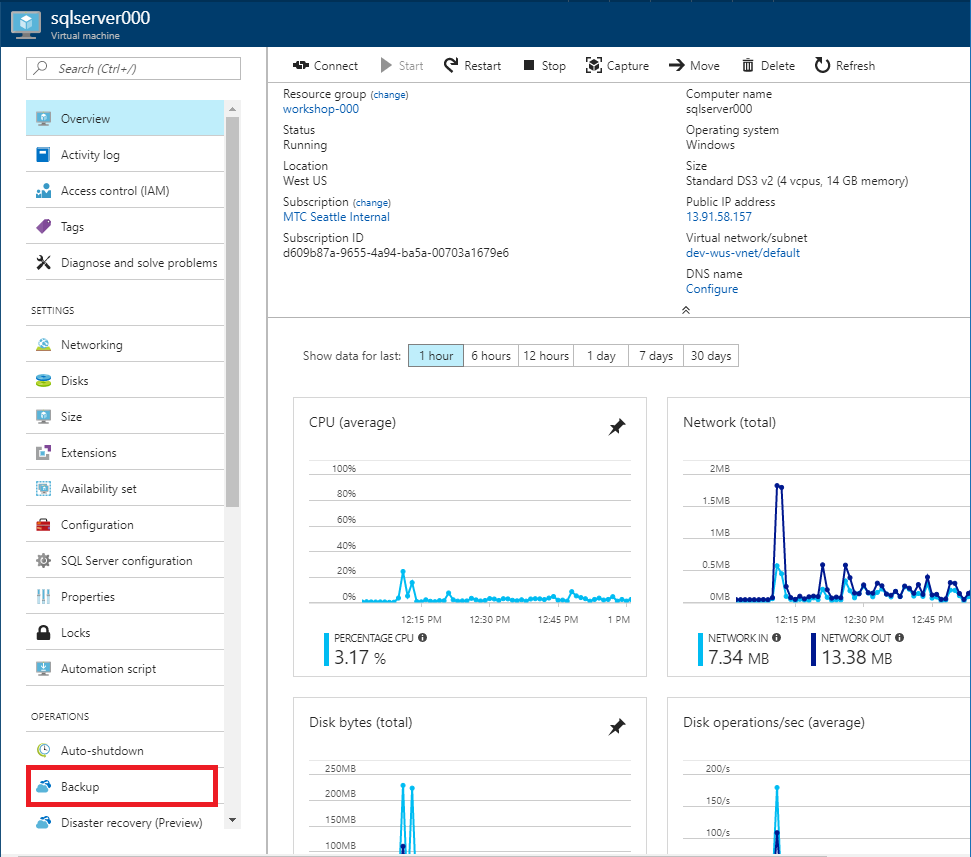
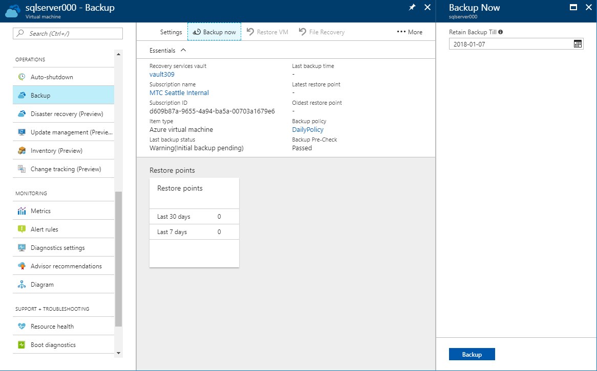
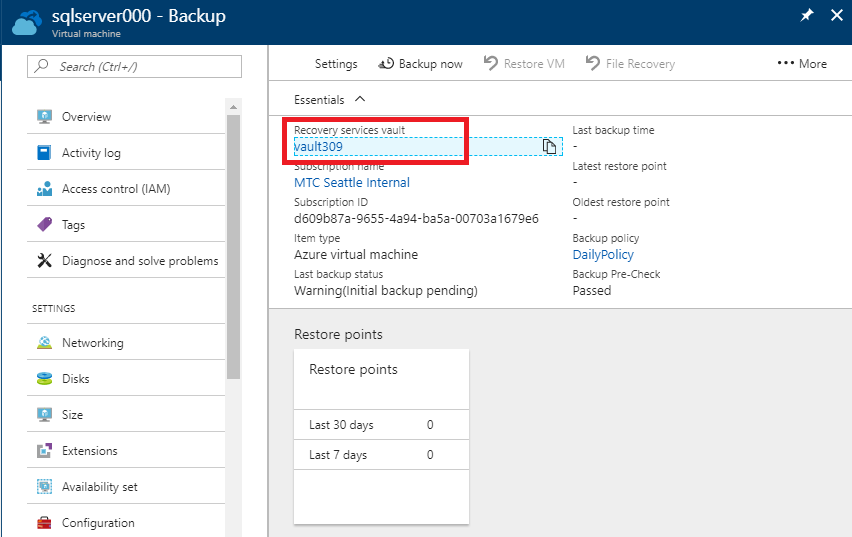
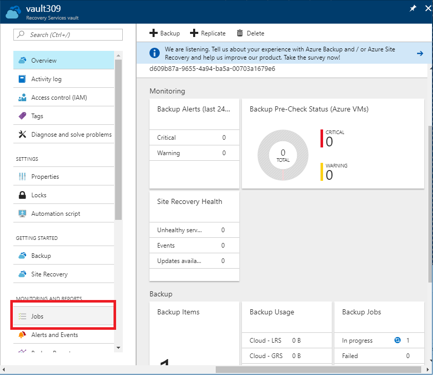
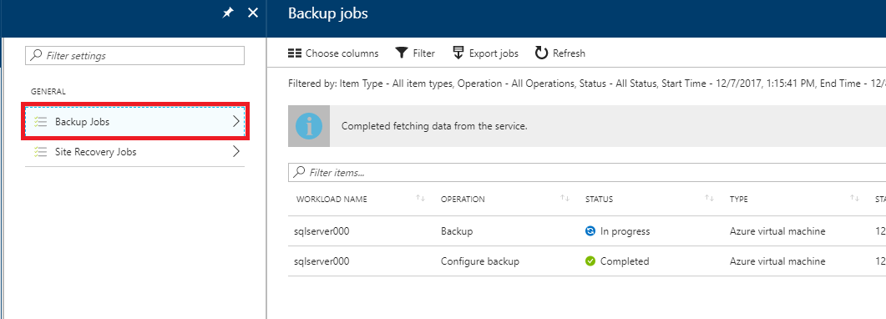

# 7. Backup Virtual Machine

Protect SQL Server Virtual Machine using Azure Backup Service.

## Architecture

## Create Azure Recovery Service Vault

1. Click 'Backup' from Virtual Machine Ooperations menu.

    

1. Create Azure Recovery Service and backup policy

    Recovery Service Vault name will be named automatically.

    Select 'Use existing' resource group.

    And click 'Backup policy' to see detail policy information.

    |Recovery Services Vault|Resource Group|Backup Policy|
    |---|---|---|
    |vault###|workshop-###|(new) DailyPolicy|

    

    Click 'OK' and then click 'Enable Backup'.

## Start Backup __NOW__

1. Click 'Backup' from Virtual Machine Operations menu.

    Click 'Backup now' from top menu. And then click 'Backup' button on the Backup Now blade.

    

1. When you click 'Backup' button, the backup will be triggered.

    

1. Detail backup job process

    To see deatil job progess, Click Recovery service vault name on the summary tab.

    

    A new Recovery Service Vault blade will be opened. Click 'Jobs' ont Monitoring and Reports menu.

    

    Additional blades will be opened. Click 'Backup Jobs' and see the detail process of your jobs.

    

    This initial backup will take an hour.

---

[>> NEXT](https://github.com/xlegend1024/az-secu-wrkshp/tree/master/8.RestoreVMData/Readme.md)
