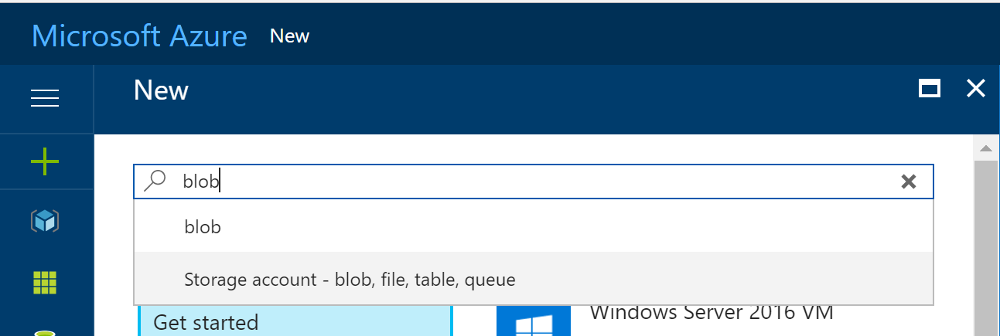
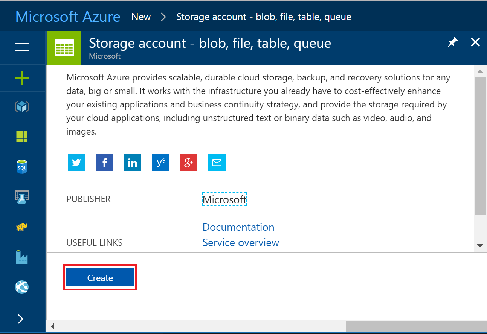
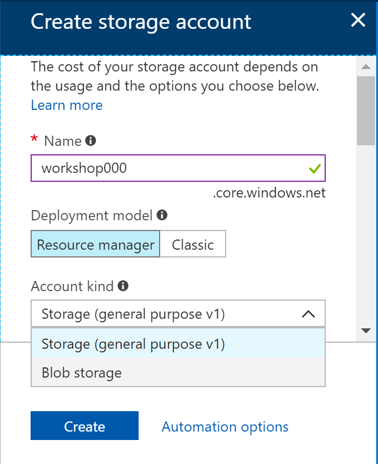
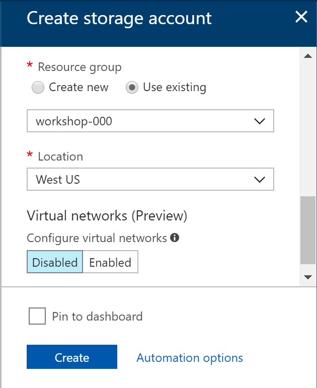
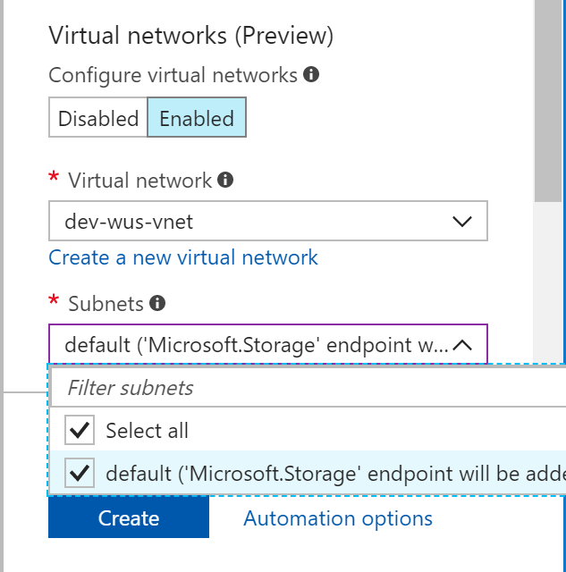
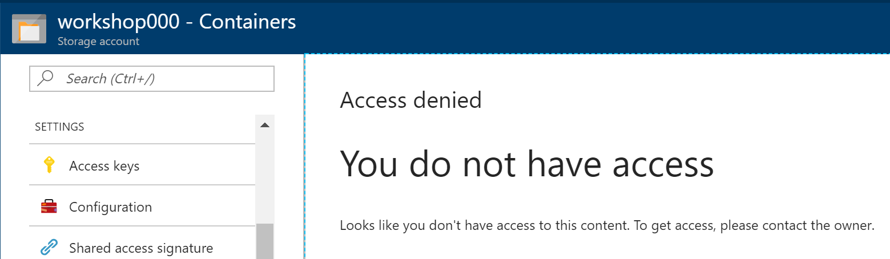

# Optional. Create Blob

Configure Virtual Network (VNet) Service Endpoints for Azure Storage.

## Architecture

## Create Blob Storage Account from Azure Portal

1. Click '+ New' and search 'Blob'

    

1. Click 'Create'

    

1. Type blob account name

    

1. Chooes replication option

    

1. Chooes resource group

    

1. __Enable__ Virtual Network

    

1. Select subnet

    

1. Click 'Create'

    

1. Blob Access will be denied

    You can't access blob from out slide of Azure Virtual Network.

    

---

[>> Next #6](https://github.com/xlegend1024/az-secu-wrkshp/tree/master/6.EncryptDB)
[>> Next #6](https://github.com/xlegend1024/az-secu-wrkshp/tree/master/6.EncryptDB)
