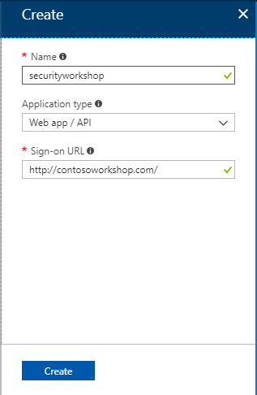
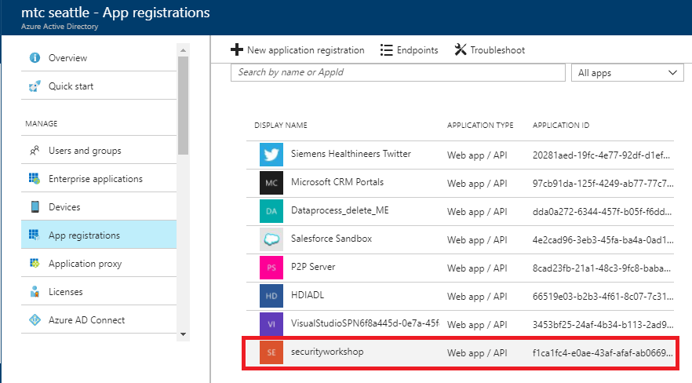
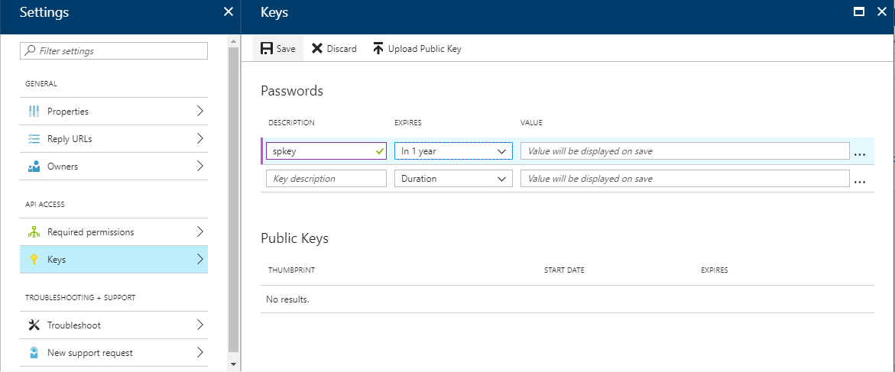
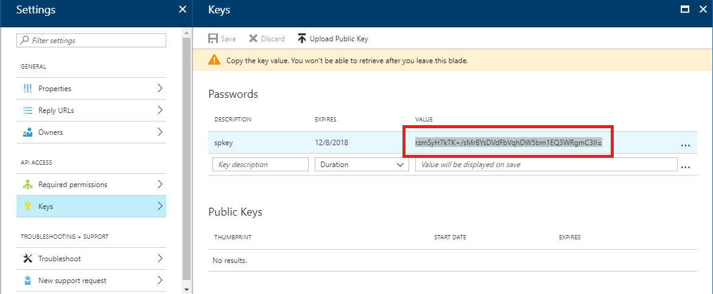
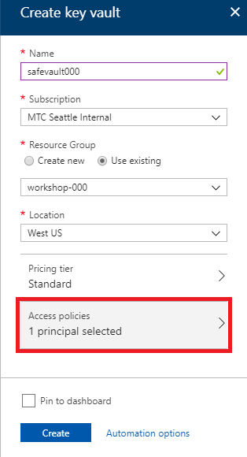
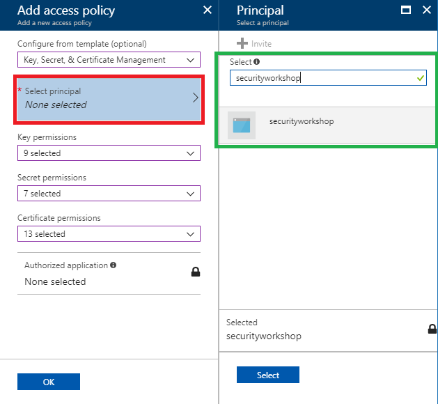
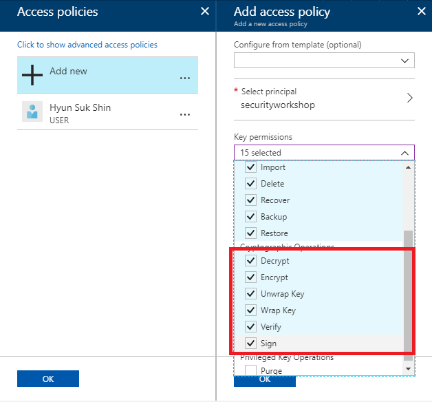
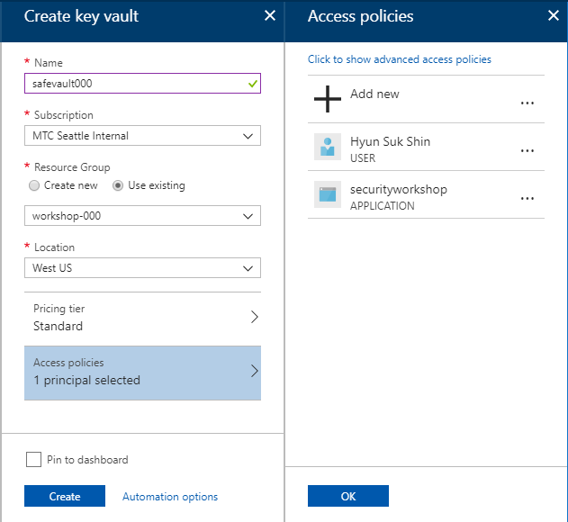

# 4. Create Key Vault

Create Azure Key Vault and create a key that will be used for SQL Server TDE key protection.

## Architecture


## Set up an Azure Active Directory Service Principal

Before set up a Azure AD Service Principal, open notepad and copy following text and paste it into the notepad.
```
AppID:
ObjID:
spKey:
KeyVaultURL:
```


1. Search Azure Active and click the service

    

1. Select 'App registration'

    

1. Click '+ New application registration'

    

1. Type name and sign-on URL.

    |Name|Application Type|Sign-on URL|
    |---|---|---|
    |securityworkshop###|Web app / API|http://contosoworkshop###.com|

    > Note: Please replace ### into random 3 digit.

    

    Click to finish the application registration.

1. Click your application

    

1. Copy Applicatoin ID and Object ID and paste them to your notepad

    

1. To create a key, click the 'Keys'

    

1. Type descriotion and select expires as 'In 1 year' and click 'Save'

    

1. When a key is saved, you'll see password on the screen. Copy the vaule and paste it to your notepad.

    

1. When application registration is done, please make sure you have AppID, ObjID and the password vaule on your note.

    

## Create a Key Vault

1. Click  '+ New' and search Key Vault. And click "Create'

1. Type new key vault name and select your resource group.

    |Name|Subscription|Resource Group|Location|Pricing tier|Access policies|
    |---|---|---|---|---|---|
    |safevault###|*yoursubscription*|workshop-###|west us|Standard|1 principal selected|

    

1. Click 'Access policies' and click '+ Add new'

    

1. Select 'Key, Secret, & Certificate Management'

    

1. Click 'Select principal'. And then search 'securityworkshop###' and click service principal fomr the result.

    

1. Check cryptographic operation 'Decrypt', 'Encrypt', 'Unwrap Key', 'Wrap Key', 'Verify' and 'Sign'.

    

1. Click 'OK'

    

1. Click 'Create'

    

1. When a Key Vault is created, copy Key Vault DNS Name and paste it to your note.

    

    Your note should have all four vaules like following.

    

## Add a Key

1.  Click 'Keys' and then click '+ Add'

    

1. Type name to create an new key. Please name it as '__securityworkshopkey__'. And then click 'Create'

    


---

[>> NEXT](https://github.com/xlegend1024/az-secu-wrkshp/tree/master/5.CreateSQLVM/Readme.md)
