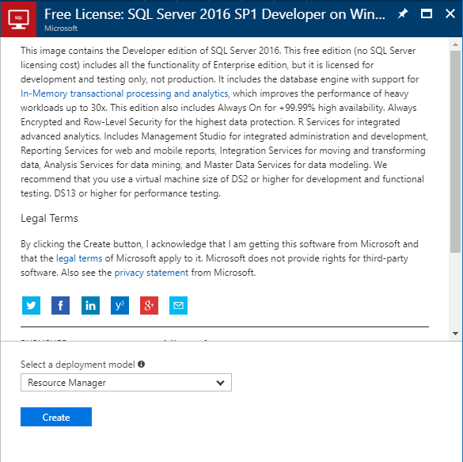
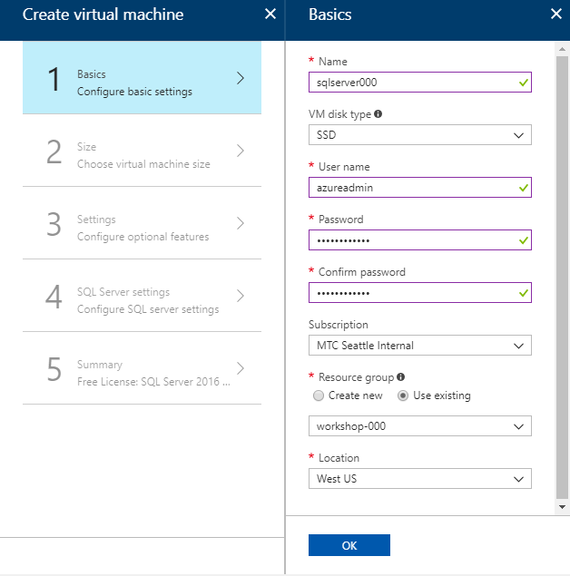
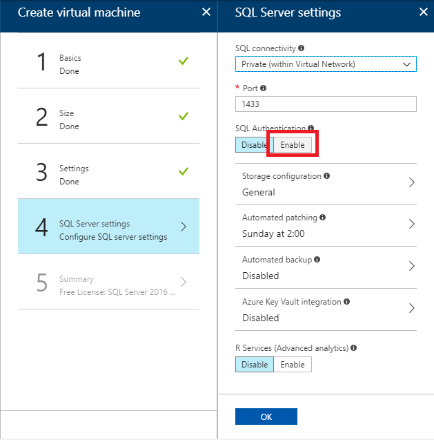
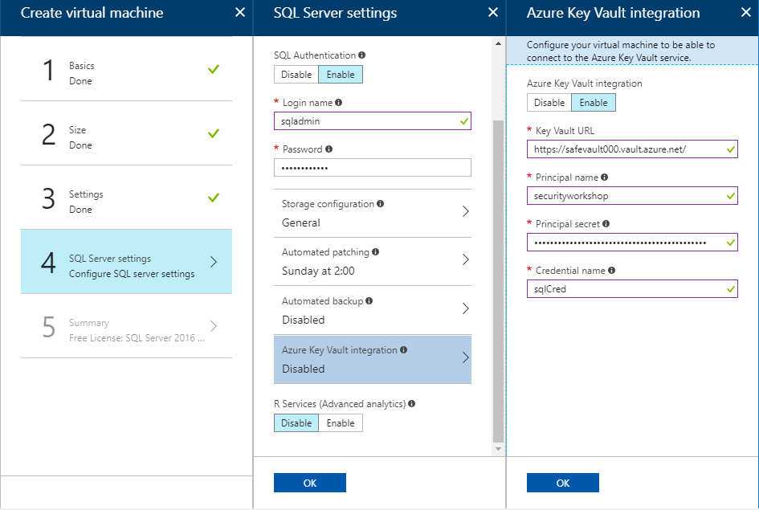

# 5. Create SQL Server Vritual Machine

## Create SQL Server 2016 Virtual Machine

1. Search 'SQL Server 2016' from Azure Marketplace

    > NOTE: Make sure choose __Developer Edition__ to mimize cost.

    

1. click 'Create' to continue

    

## Create Virtual Machine wizard

1. __Basics__

    |Name|VM disk type|User Name|Password|Confirm Password|Subscription|Resource Group|Location|
    |---|---|---|---|---|---|---|---|
    |sqlserver###|SSD|azureadmin|strongpassword|strongpassword|*yoursubscription*|workshop-###|West US|

    

1. Size

    Select size and click 'Select'.

    

1. Settings

    Click 'Network Security Group (firewall)'.

    

    Select 'None'. And click 'OK'.

    

1. SQL Server settings

    * Click 'Enable'.

    

    * Change login name as 'sqladmin'. Password will be same as os admin.

    

    * Click 'Azure Key Vault integration' and click 'Enable' in the Azure Key Vault integration blade.

    

    * Copy Key Vault URL and spKey from your note and paste them to Key vault URL and Principal secret.

    * Type Principal name 'securityworkshop###'. Please note, ### should be replaced into 3 digits.

    * Type 'sqlCred' in Credential name.

    

    Click 'OK' and click 'OK' in 'SQL Server settings' blade.

1. Summary

    Click 'Create'. The vitual machine will be created within 11 minutes.

    

---

[>> NEXT](https://github.com/xlegend1024/az-secu-wrkshp/tree/master/6.EncryptDB/Readme.md)

---

## [__OPTIONAL__] Insatll sample web site

1. Run following scription at Cloud Shell Script window.

    > NOTE: Before run the script, please replace ### same as your resource name.

```bash
az vm extension set --publisher Microsoft.Compute \
                    --version 1.8 --name CustomScriptExtension \
                    --vm-name sqlserver2016 \
                    --resource-group workshop-### \
                    --settings '{"commandToExecute":"powershell.exe Add-WindowsFeature Web-Server,Web-Asp-Net45,NET-Framework-Features"}'
```

1. Access to the SQL Server Virtual Machine

1. On the remote SQL Server VM, download sample web site 

    Donwload sample asp.net website from [here](https://raw.githubusercontent.com/xlegend1024/az-secu-wrkshp/master/SampleWebApp/SampleWebApp.zip). Unzip SampleWebApp.zip and copy files to 'C:\inetpub\wwwroot\'.
