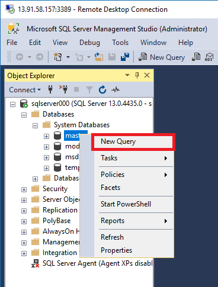
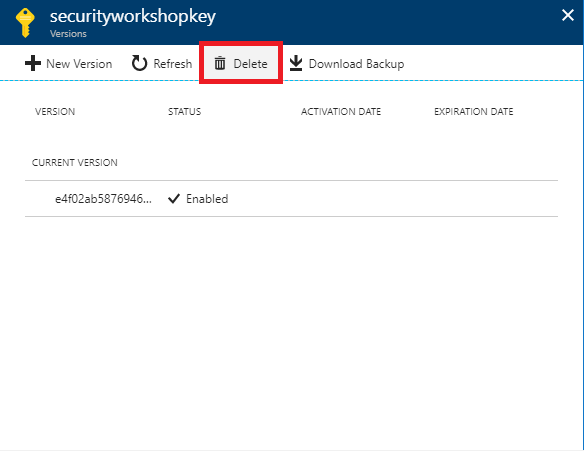
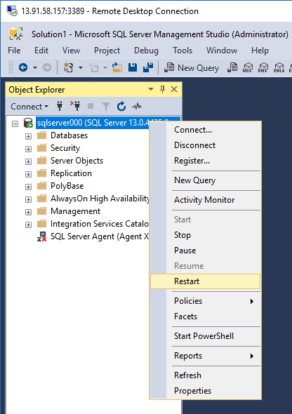
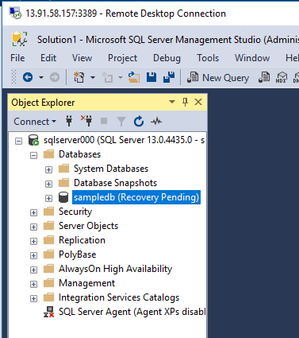
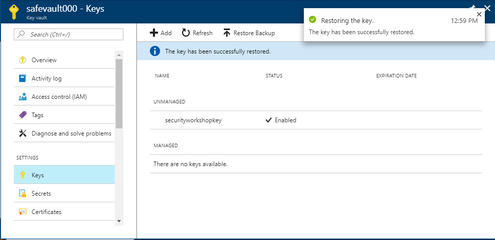
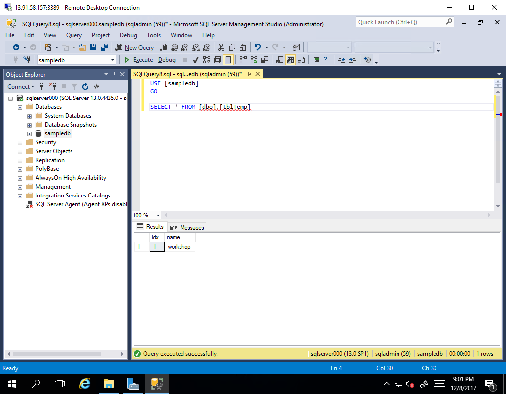

# 6. Encrypt Database

## Remotely access SQL Server Virtual Machine

1. Click your virtual machine

	

1. Click 'Connect'

	

1. Enter credential to access the virtual machine

	

## Enable TDE for your database

1. Run SSMS (SQL Server Management Studio)

1. Click connect

	

1. Right click on master databse, click 'new query' to open query window.

	

1. Copy following sql and run it

	```sql
	USE [master];
	-- Use the EKM to open the asymmetric KEK that was previously created in the Key Vault
	CREATE ASYMMETRIC KEY TDE_KEY -- Give the asymmetric KEK a name in SQL Server 
		FROM PROVIDER AzureKeyVault_EKM_Prov WITH
		PROVIDER_KEY_NAME = 'securityworkshopkey', -- The name of the asymmetric KEK in Azure Key Vault
		CREATION_DISPOSITION = OPEN_EXISTING -- To indicate that this is an existing key in Azure Key Vault
	```

1. Copy following sql and run it

	```sql
	CREATE LOGIN TDE_Login
	FROM ASYMMETRIC KEY TDE_KEY ;
	GO
	```

1. Copy following sql and run it

	```sql
	-- Alter the TDE Login to add this Credential for use by the Database Engine to access the Key Vault
	ALTER LOGIN TDE_Login 
	ADD CREDENTIAL sqlCred;
	GO
	```

1. Copy following sql and run it

	```sql
	CREATE DATABASE [sampledb]
	CONTAINMENT = NONE
	ON  PRIMARY
	( NAME = N'sampledb', FILENAME = N'F:\Data\sampledb.mdf' , SIZE = 8192KB , FILEGROWTH = 65536KB )
	LOG ON
	( NAME = N'sampledb_log', FILENAME = N'F:\Log\sampledb_log.ldf' , SIZE = 8192KB , FILEGROWTH = 65536KB )
	```

1. Copy following sql and run it

	```sql
	USE [sampledb];
	GO
	CREATE DATABASE ENCRYPTION KEY
	WITH ALGORITHM  = AES_256
	ENCRYPTION BY SERVER ASYMMETRIC KEY TDE_KEY;
	GO
	```

1. Copy following sql and run it

	```sql
	-- Alter the database to enable transparent data encryption.
	-- This uses the asymmetric KEK you imported from Azure Key Vault to wrap your DEK.
	ALTER DATABASE [sampledb]
	SET ENCRYPTION ON ;
	GO
	```

1. Copy following sql and run it

	```sql
	USE [sampledb]
	GO

	CREATE TABLE [dbo].[tblTemp](
		[idx] [int] IDENTITY(1,1) NOT NULL,
		[name] [nchar](10) NULL
	) ON [PRIMARY]
	GO

	INSERT INTO [dbo].tblTemp VALUES ('workshop')
	GO

	SELECT * FROM [dbo].[tblTemp]
	GO
	```

1. Check TDE option of the sample database

	

## Backup a key from Azure Key Vault to your computer

1. Go to your Azure Key Vault

1. Click 'Key' and then click the key

	

1. click 'Download Backup' and save the file to your computer

	

## Delete a Key from Azure Key Vault

1. Go to your Azure Key Vault and find the key. Click 'Delete'.

	

## Restart SQL Server

1. Restart SQL Server

	

1. When SQL Server is started again, you'll see your sample database is in recovery pending status.

	

## Restore Key to the Key Vault

1. Go back to Azure Key Vault and click 'Keys'.

1. Click 'Restore Backup' and select the key backup file.

	

1. Wait until your key is restored

	

## Restart SQL Server

1. Restart SQL Server

	

1. When SQL Server is started again, run sample query.

	```sql
	USE [sampledb]
	GO

	SELECT * FROM [dbo].[tblTemp]
	GO
	```

	

---

[>> NEXT](https://github.com/xlegend1024/az-secu-wrkshp/tree/master/7.BackupVM/Readme.md)
