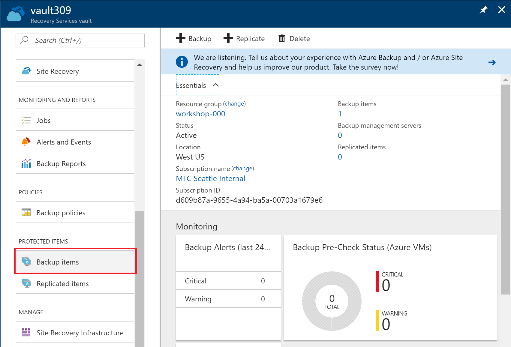
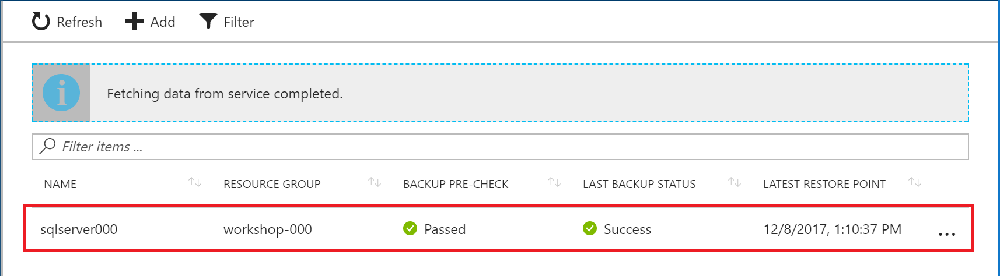
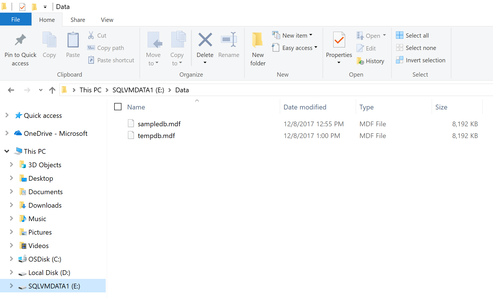

# 8. Restore VM / Data

Protect SQL Server Virtual Machine using Azure Backup Service.

## Architecture

## Review Restore Options

1. Search Recovery Service Vault and click the service on the result list.

    

1. Find 'Backup Items' on the lift lists and click 'Backup Items'

    

    Click Azure Virtual Machine.

    

    Click backup item.

    

1. You'll see two options on the menu

    

    * __Restore VM__

        You can create a Virtual Machine from the backup.
        

    * __File Recovery__

        You can restore some files from the backup withou restoreing whole entire Virtual Machine.
        

## Restore Files

File recovery option is a quick and easy way to revoer some files from the backup.

1. Select __File Recovery__ option

    

1. Download Executeable 

    * Click 'Download executeable'

    

    * Run the download file as administrator

    

1. Use password to mount disk to your local computer

1. Access disks

    You can restore some files from backup without restoring a Virtual Machine.

    

1. When you finished file recovery work, unmount the disks from your local computer.

    

---

[>> NEXT](https://github.com/xlegend1024/az-secu-wrkshp/tree/master/9.RemoveResources/Readme.md)
