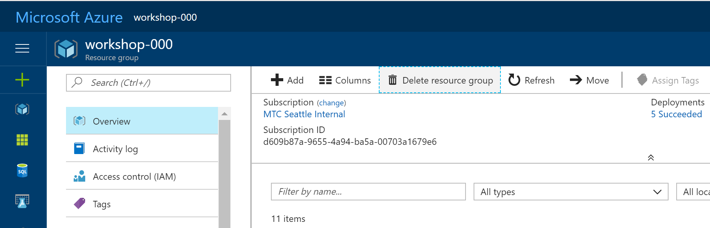

# 9. Remove Resource

## Delete Resource Group

This resource group delete will be asynchronous job. Once you confirm the resource group delete, you can move to next step, Application delete. 

1. Search your resource group, 'workshop-###', and click the resource group on the list.

    

1. Click 'Delete resource group'.

    

1. Confirm the resource group termination.

    

## Delete Application from Azure Active Directory

1. Search Azure active Director

    

1. Select 'App regstrations'

    

1. Select application you created for the workshop

    

1. Click 'Delete'

    
