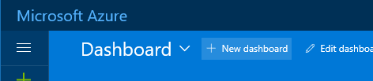
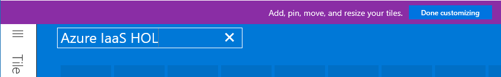
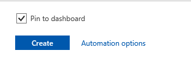
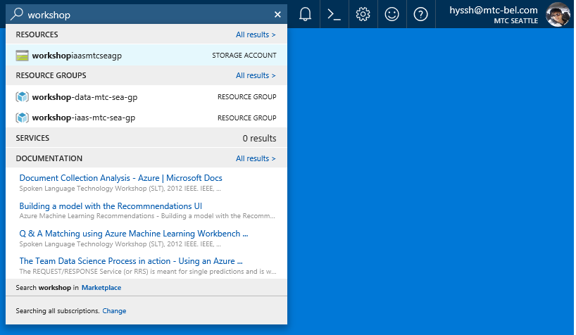

# Microsoft Azure Security Workshop

Date: 12/07/2017
Author: Hyunsuk Shin (hyssh@microsoft.com)

## Goal

Implement a secure cloud environment for SQL Server Virtual Machine.

## Workshop Scenario

There are multiple ways to attack or still data from servers. On the other hands, there are also many services to protect data from variety of threat. To have a safe environment multiple level of protection should be considered and implemented. Also monitoring is important as well. For a secure cloud environment, you can leverage many Azure Services to protect data from different level of attacks. For example, simple you can use Network Security Group to control network access to a Virtual Machine. Or you can use Key Vault to encrypt database on the Virtual Machine.

## Architecture

Following is a sample architecture you are going to build in this lab.

## Agenda

[>> Lab #1](https://github.com/xlegend1024/az-secu-wrkshp/tree/master/1.CreateResourceGroup)

[>> Lab #2](https://github.com/xlegend1024/az-secu-wrkshp/blob/master/2.CreateVNet/Readme.md)

[>> Lab #3](https://github.com/xlegend1024/az-secu-wrkshp/blob/master/3.CreateNSG/Readme.md)

[>> Lab #4](https://github.com/xlegend1024/az-secu-wrkshp/blob/master/4.CreateKeyVault/Readme.md)

[>> Lab #5](https://github.com/xlegend1024/az-secu-wrkshp/blob/master/5.CreateSQLVM/Readme.md)

[>> Lab #6](https://github.com/xlegend1024/az-secu-wrkshp/blob/master/6.EncryptDB/Readme.md)

[>> Lab #7](https://github.com/xlegend1024/az-secu-wrkshp/blob/master/7.BackupVM/Readme.md)

[>> Lab #8](https://github.com/xlegend1024/az-secu-wrkshp/blob/master/8.RestoreVMData/Readme.md)

[>> Lab #9](https://github.com/xlegend1024/az-secu-wrkshp/blob/master/9.RemoveResources/Readme.md)

---

## __Tips__ for Hands on Lab

### __Make your own Azure Portal Dashboard__

Please follow next two steps to create your own dashboard first.

1. Log on [Azure portal](https://portal.azure.com).

1. Click '+ New Dashboard' on the portal.

  

  Change name of the dashboard and click 'Done customizing' to save name. And you'll see empty dashboard.

  

---

### __Pin to dashboard__

When you create resource you'll see 'Pin to dashboard'. Check the box when you create a resource so you can have short cut to access to a resource.

  

---

### __Use search to find your resource or Azure service__

To find your specific resource you can use search at the Azure portal.

  

---

[>> NEXT](./1.CreateResourceGroup/Readme.md)
